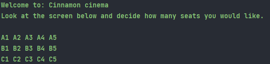
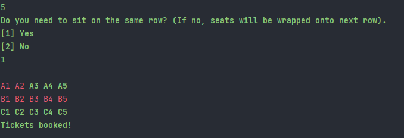
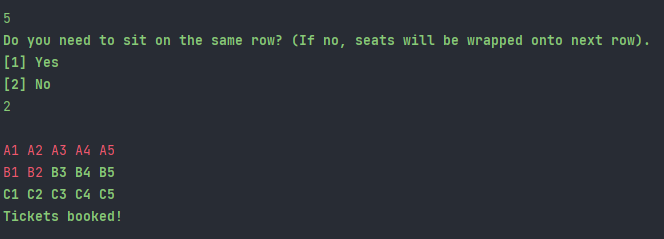

# Cinnamon Cinema Kata 
## Created in Java using a Test Driven Development (TDD) Approach
The movie theatre has three rows (A, B, C) of five seats (1,2,3,4,5).  

Methods ensure that a user can select a number of seats.  Seats are filled from front to back (A to C) left to right (1 to 5).
The application displays a grid showing the cinema seats, as shown below.  Available seats are shown in green and booked seats in red. 

The user will be asked to enter the number of seats they would like to book and then whether they need these to be together (on the same row) or if they can wrap onto the next row. 
As can be seen below, the user selected 5 seats and said they must be together so they have been given the next row (B1-B5). 

The next image shows when a user says that they do NOT  need to be seated together.

The application will continue to run until ALL seats have been booked. 

### How to run the application
To run this application, start the main method from Main class.  This will randomly assign seats until the cinema is full.
This is shown via command line displaying a coloured grid of the seats at each stage they are assigned.

## Future Considerations
This application can be expanded to do the following:
* User Interface to allow users to type in/select the number of seats required
* Have a bigger sized theatre (e.g. more rows or more seats per row or even varying numbers per row)
* Have seats assigned to individual movies/show times
* Add ticket objects for users
